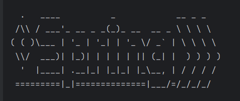
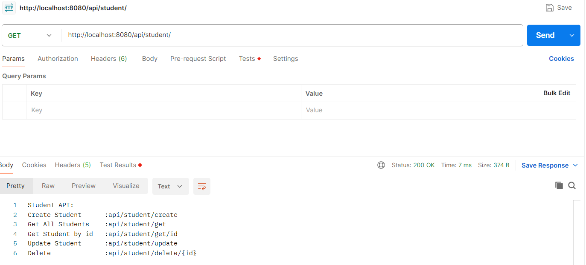
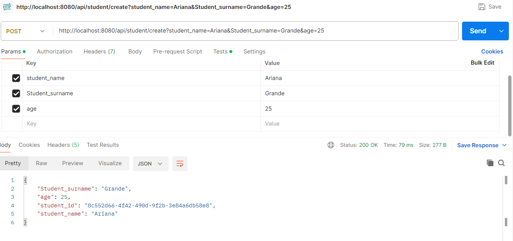
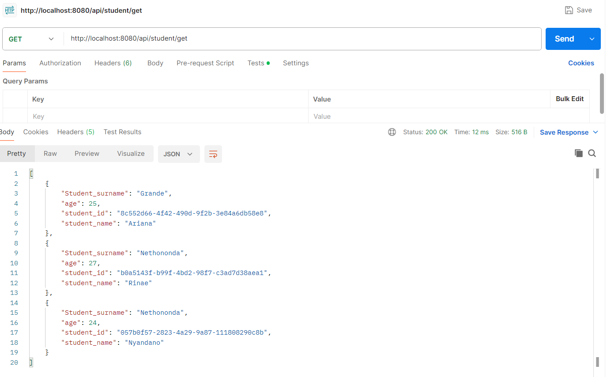
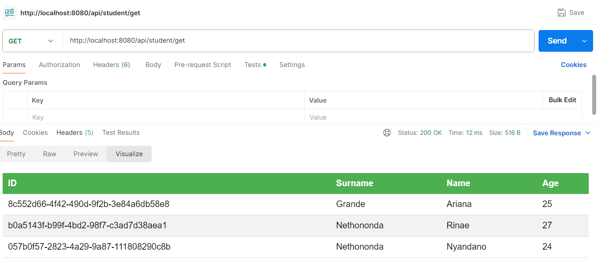
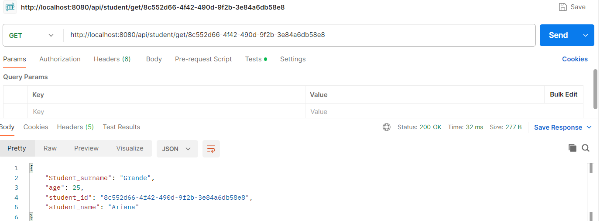
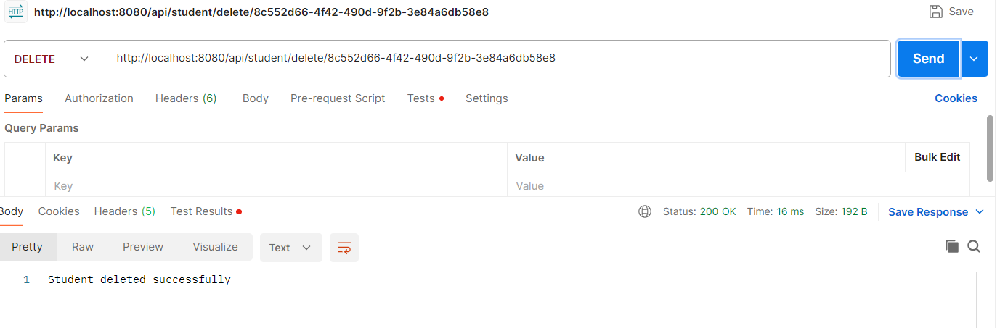

# 🎓 Spring Boot Student CRUD API

A clean and lightweight **Student Management REST API** built with Spring Boot, supporting full CRUD operations for managing student records.

---

## 🚀 Tech Stack

---

## 📁 Project Structure
- **Controller** – REST endpoints  
- **Service** – Business logic  
- **Repository** – JPA data access  
- **Entity** – Student entity  
- **Resources** – Configurations  
- **Screenshots** – Postman results  

---

## 🌐 API Summary
**Base URL:** `http://localhost:8080/api/student`

API Operations:
- Health check  
- Create student  
- Retrieve all students  
- Retrieve student by ID  
- Update student  
- Delete student  
- Error handling (404)  

---

## 📸 Postman Screenshots

All testing screenshots are stored in the `screenshots/` folder:

- **Home Endpoint**  
  

- **Create Student**  
  

- **Get All Students**  
  

- **Get all visualisazi**
  

- **Get Student by ID**  
  

- **Delete Student**  
  

  - **After Delete Student**  
  

---

## ▶️ Running the App
1. Install Java 25 + Maven  
2. Build the project  
3. Run the Spring Boot application  
4. Access the API at **http://localhost:8080/api/student**

---

## 🗄️ Database
- Uses **H2 in-memory database**  
- Auto-creates tables  
- Data resets on restart  
- H2 console: `/h2-console`  

---

## 🧪 Postman Collection
A Postman collection is included for quick testing of all API endpoints.

---

## 🛠️ Troubleshooting
- Verify Java & Maven versions  
- Ensure port **8080** is free  
- Check H2 database settings  
- Confirm endpoint paths  

---

